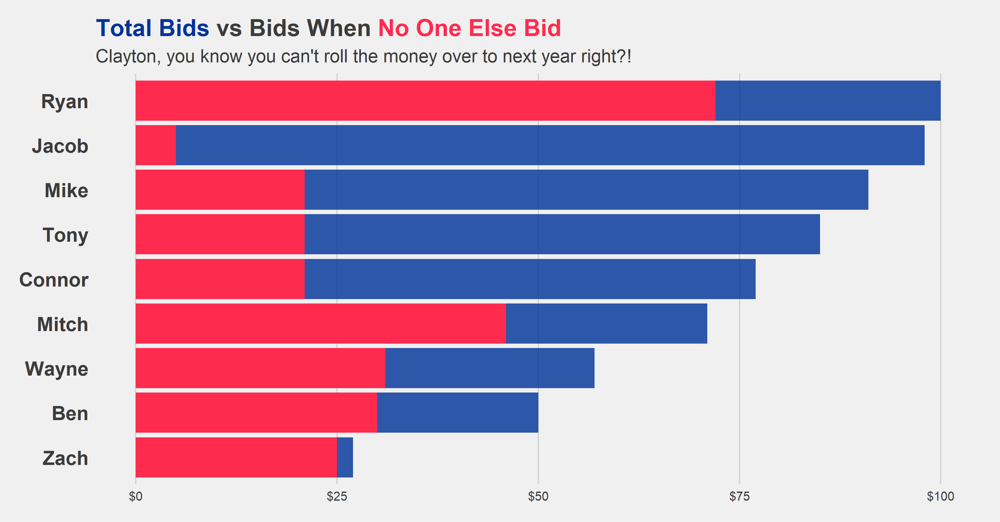
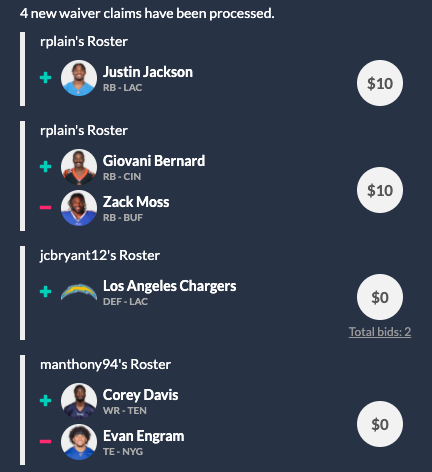
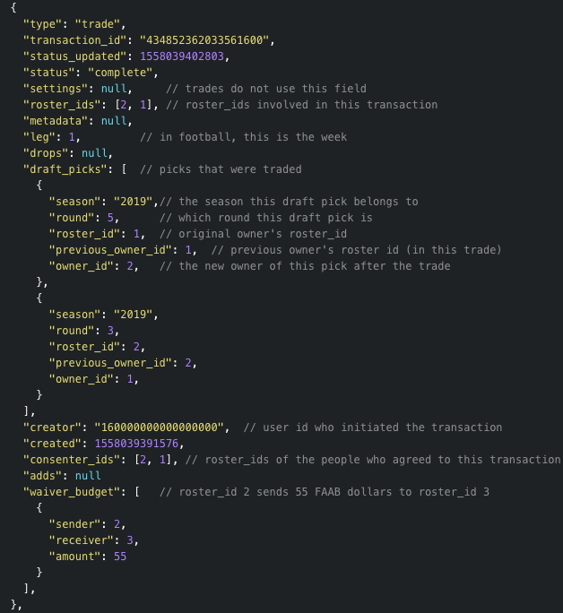
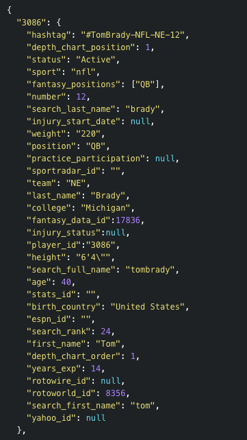

```{r setup, include=FALSE}
knitr::opts_chunk$set(echo = TRUE)
```


```{r, out.width='100%', echo=FALSE}


```


# Fantasy Football

We recently wrapped up our 2020 Fantasy Football season. In a standard regular season long league, you draft your initial team of 15 players prior to the season as your foundation. Players that go undrafted are then moved to the *waiver wire*. There are several different methods leagues can do to organize this, our league uses a blind bidding system, sometimes referred to as **FAAB** (Free Agent Auction Budget). 

Every team starts with a $100 budget. Players that are on the waiver wire can be bid on following weekly games, with the transactions processing Tuesday night. The highest bidder will then receive rights to that player on their team.

This provides an additional layer of strategy to the game. One thing I noticed this year, was just how poor of a job I did this season! I wasted a good portion of my budget on players that no one else placed bids on. (I may or may not have finished in last place this year...)


```{r, out.width='60%', echo=FALSE}


```


On this particular day, I bid $10 on 2 different players that no other team bid on. Had I played it better, I could have had both of them for free. This is the added dimensionality FAAB brings.

Our league used a platform [Sleeper](https://sleeper.app/)  to host our Fantasy Football league.

I'll go over how I accessed our leagues data, and created a couple of visualizations to show just how bad I was!


---

## Workflow

Import the necessary libraries

```{r, results='hide', message=FALSE, warning=FALSE}
library(tidyverse) # all the things
library(rvest) # webscraping
library(jsonlite) # json to dataframe
library(httr) # GET request
library(reticulate) # python
library(ggtext) # add markdown elements to ggplot
library(ggthemes) 
library(paletteer)
library(gt) # beautiful tables in R
```


### Setup Data

There are 16 weeks of games in Fantasy Football. I'll be using Sleeper's API to pull transactions from my league. The API only supports read functionality, so no harm in sharing my league id!

The response found on [Sleeper's documentation](https://docs.sleeper.app/#get-transactions)


```{r, out.width='60%', echo=FALSE}


```
#### Below is the call for week 1

```{r}

url = glue::glue('https://api.sleeper.app/v1/league/580173188063862784/transactions/1')
res = httr::GET(url)
res_json <- rawToChar(res$content)
df <- jsonlite::fromJSON(res_json) %>% 
    as_tibble() %>% 
    janitor::clean_names() %>% 
    select(-starts_with("drops"))

head(df)
```


I left the default tibble output to show what kind of mess we are dealing with. Any json data that is still nested will either be as lists or dataframes within the tibble. Players added and dropped are stored as their player id and the roster id (which won't be used for this analysis). These will be stored as a nested data frame of the player ids as columns and roster id as rows. 

```{r, echo=FALSE}
rmarkdown::paged_table(df$adds)
```

For this analysis, I do not need roster positions. All that is needed is the column names which are the id's of the players added. 

--- 

### Flatten the data

My solution, was to flatten the response, which creates columns for each player added. From there, pivot longer on the player's id columns which duplicated the transaction for all 10 league members. 

To tidy the dataset all that needs to be done now is to filter out NA values from the pivot, making each transaction a row of 1 player attempted to be added, with a status of **Complete** or **Failed**.


```{r, warning=FALSE, message=FALSE, layout="l-body-outset"}
dfs <- tibble()
for (i in 1:16) {
  url = glue::glue('https://api.sleeper.app/v1/league/580173188063862784/transactions/{i}')
  res = httr::GET(url)
  res_json <- rawToChar(res$content)
  df <- jsonlite::fromJSON(res_json, flatten = T) %>% 
    as_tibble() %>% 
    janitor::clean_names() %>% 
    select(-starts_with("drops"))
  
  df <- df %>% 
    pivot_longer(
      cols = starts_with("adds"), 
      names_to = "add",
      values_to = "value1"
    ) 
  df <- df %>% 
    rename(bid = settings_waiver_bid) %>% 
    select(-waiver_budget, -roster_ids, -draft_picks, -consenter_ids, -starts_with("setting"))
  
  df <- df %>% 
  mutate(add = str_remove(add, "adds_") %>% str_to_upper())
  
  dfs <- rbind(dfs, df)
}

dfs <- dfs %>% 
  rename(week = leg) %>% 
  filter(!is.na(value1)) %>% 
  select(-status_updated, -value1)

rmarkdown::paged_table(dfs)
```

---

## Player's Data

To get the player's information, I will call the API for players with Python. 


```{r, out.width='60%', echo=FALSE}


```
**\*Important to note: the size is rather large, and Sleeper has requested that this call is done no more than once a day to update a database **

### Load in Python Librarys
```{python}
import pandas as pd
import requests
```

The response can be parsed as a python dictionary. By creating a pandas data frame from the response, every column will be a player with every row what would normally be a field. 

Easy enough, we can transpose the dataframe so that it is in the format needed to join. 


```{python}
r = requests.get("https://api.sleeper.app/v1/players/nfl")
players = r.json()
players = pd.DataFrame(players).T
players = players.reset_index()
players = players[['index','full_name','gsis_id','fantasy_positions','weight','team']]

```


### League Users

One of the fields in the transactions table is "Creator". It is an id that can be paired with the username from the users table. 

```{python}
r = requests.get("https://api.sleeper.app/v1/league/580173188063862784/users")
users = r.json()
users = pd.DataFrame(users)
```


---

## Back to R

Now that all the data needed for the analysis has been brought in, I'll use {reticulate} to access the python data with R.

```{r}
users <- py$users %>% 
  as_tibble() %>% 
  select(avatar, display_name, user_id)
```

### MORE DATA WRANGLING!

Eventually this data will be good to go. 

I originally found that passing the data from python to R created a regular data.frame() in R. When I used as_tibble(), it would create more nested structures, columns would contain numeric and character values which were formatted into lists. 

Steps:

1. Filter to only players that are in the transactions table.
2. Get rid of unnecessary problematic columns
3. Adjust types of columns
4. Create tibble, which still would have each field containing a list of length 1
5. Unnest, since list was of length 1 the number of rows remained the same


```{r}
pyplayers <- py$players

ids <- dfs$add %>% unique()
ids <- append(ids, df$drop %>% unique())
ids <- unique(ids)

pyplayers <- pyplayers %>% 
  mutate(index = as.character(index)) %>% 
  filter(index %in% ids) %>% 
  select(-gsis_id, -weight) %>% 
  mutate(full_name = ifelse(is.na(full_name),"",full_name)) %>% 
  as_tibble() %>% 
  unnest(full_name) %>% 
  unnest(team) %>% 
  unnest(fantasy_positions) %>% 
  mutate(full_name = ifelse(full_name == "", team, full_name)) %>% 
  group_by(index) %>% 
  mutate(rn = row_number()) %>% 
  filter(rn == 1) 

```


### Join Data

Finally! Now that the data is prepped, it is time to join them together to start analysis.

```{r}
df <- left_join(dfs, pyplayers, by=c("add"="index")) 

df <- left_join(df, users, by=c("creator" = "user_id"))

```


### Work with Dataframe

A quick summary of each person, how much they spent on players in total and unopposed. 

```{r, echo=FALSE}
df %>% 
  group_by(week, full_name) %>% 
  mutate(num_bids = n()) %>% 
  filter(num_bids == 1, status == "complete") %>% 
  ungroup() %>% 
  group_by(display_name) %>% 
  summarise(no_opposition = sum(bid, na.rm = T),
            player_amount = max(bid, na.rm = T), .groups = 'drop') %>% 
  rmarkdown::paged_table(.)
```

Now to create 3 dataframes to be joined together.

1. Bids where a user was the only person to bid
2. What player each user "wasted" the most FAAB on
3. Total amount of FAAB spent  

Since I knew my leaguemates personally, I went ahead and added their first names in the dataset.  

```{r, message=FALSE, warning=FALSE}

lonesome_bids <- df %>% 
  group_by(week, full_name) %>% 
  mutate(num_bids = n()) %>% 
  filter(num_bids == 1, status == "complete") %>% 
  ungroup() %>% 
  group_by(display_name) %>% 
  summarise(no_opposition = sum(bid, na.rm = T),
            .groups = 'drop') 

highest_player <- df %>% 
  group_by(week, full_name) %>% 
  mutate(num_bids = n()) %>% 
  filter(num_bids == 1, status == "complete") %>% 
  ungroup() %>% 
  filter(bid > 0) %>% 
  group_by(display_name, full_name) %>% 
  summarise(max_bid = max(bid), .groups = 'drop') %>% 
  group_by(display_name) %>% 
  arrange(-max_bid) %>% 
  mutate(rn = row_number()) %>% 
  filter(rn == 1) %>% 
  ungroup()

total <- df %>% 
  filter(status == "complete") %>%
  group_by(display_name) %>% 
  summarise(total_spent = sum(bid, na.rm = T), .groups = 'drop')

dat <- inner_join(lonesome_bids, total) %>% 
  inner_join(., highest_player, by="display_name") %>% 
  mutate(display_name = case_when(
    display_name == "jcbryant12" ~ "Clayton",
    display_name == "rplain" ~ "Ryan",
    display_name == "ZachAttack14" ~ "Zach",
    display_name == "benmann26" ~ "Ben",
    display_name == "waynemcfadin" ~ "Wayne",
    display_name == "manthony94" ~ "Mitch",
    display_name == "DirtyMcCurdy" ~ "Connor",
    display_name == "sauceboss91" ~ "Tony",
    display_name == "OnlyMike19" ~ "Mike",
    display_name == "Callmedougfunny" ~ "Jacob",
  )) 
```

## Final Result


```{r}
p <- dat %>%   
  ggplot(aes(y=reorder(display_name, total_spent))) +
  geom_col(aes(x=total_spent), fill="#003399", width = 0.9, alpha=0.81) +
  geom_col(aes(x=no_opposition), fill = "#ff2b4f", width = 0.9, alpha=01) +
  theme_fivethirtyeight() +
  labs(
    title = '<span style = "color: #003399">Total Bids</span> vs Bids When <span style = "color: #ff2b4f">No One Else Bid</span>',
    subtitle = "Clayton, you know you can't roll the money over to next year right?!",
    x=NULL,
    y=NULL
  ) +
  theme(
    panel.grid.major.y = element_blank(),
    panel.grid.minor.x = element_blank(),
    plot.title = element_markdown(),
    plot.subtitle = element_text(
      size = 14
    ),
    axis.text.y = element_text(
      size = 15, 
      #angle = 45, 
      face = "bold"
    )
    ) +
  scale_x_continuous(labels=scales::dollar_format()) +
  scale_fill_manual(values = c("#ff2b4f", "#003399")) 

```
<center>
```{r, echo=FALSE}
p
```

</center>

Wow! My name is Ryan, and I have a spending problem. I spent more budget on players that no one else bid on than half of the league did in total. 

<br>

```{r}
dat %>% 
  arrange(-no_opposition) %>% 
  select(Name = display_name, `Total Bid` = total_spent, Player = full_name, Bid = max_bid, `Only Bidder` = no_opposition) %>% 
  gt() %>% 
  data_color(
    columns = vars(`Only Bidder`),
    colors = scales::col_numeric(
      palette = as.character(paletteer::paletteer_d("ggsci::red_material", n = 5)),
      domain = NULL
    )) %>%  fmt_currency(
    columns = vars(`Only Bidder`, `Total Bid`, Bid),
    decimals = 0,
  ) %>% 
  cols_align(
    align = "right",
    columns = vars(`Only Bidder`, `Total Bid`, Bid)
  ) %>% 
   tab_style(
    style = list(
      cell_borders(
        sides = "left",
        color = "black",
        weight = px(3)
      )
    ),
    locations = list(
      cells_body(
        columns = vars(`Only Bidder`)
      )
    )
  ) %>%
  tab_style(
    style = list(
      cell_borders(
        sides = "bottom",
        color = "black",
        weight = px(3)
      )
    ),
    locations = list(
      cells_column_labels(
        columns = gt::everything()
      )
    )
  ) %>% 
   cols_label(
    `Total Bid` = "Total Spent",
    Name = ""
  ) %>% 
  tab_header(
    title = md("**Mistakes Were Made**"),
    subtitle = "How much each person spent, along with who they wasted the most money on"
  )


```

---

I wanted to give thanks to Thomas Mock and his blog [The Mockup Blog](https://themockup.blog/). 

He is an excellent resource, both with the site as well as on Twitter. 


